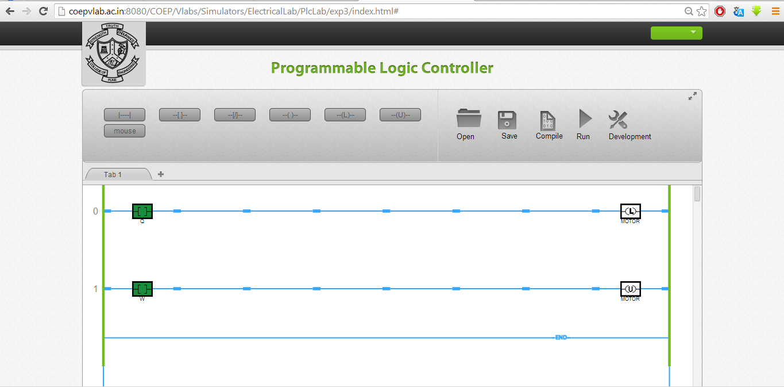

### Procedure

### Open the Simulator window as described in the last experiment
1. The Latch and unlatch instructions are used for holding the output status.
2. The tag name of latch and unlatch output bit must be same.
3. Once you toggle the input bit for the latch; even if you release it by toggling once again, the output bit remains latched.
4. To unlatch the output you will have to toggle the input bit in the unlatch rung and the output will be de-energised.

#### Execute the following ladder on simulator and observe the output status:

* You can develop ladder for a DOL "Direct On Line" starter using these instructions.
* You can also develop the logic using start and stop push buttons as explained under theory tab.
* Observe the output status at different input conditions. 
