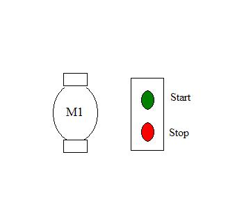
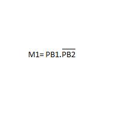
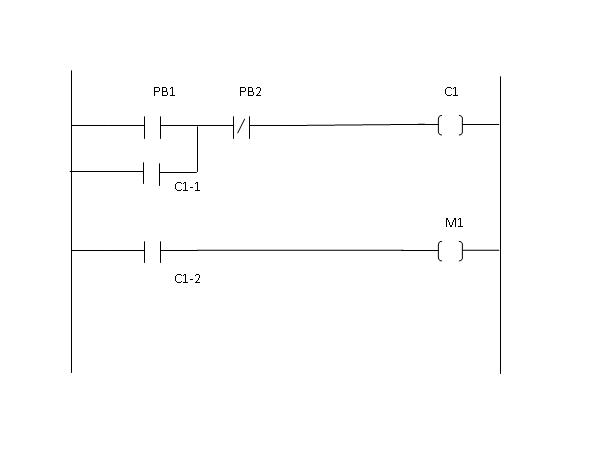
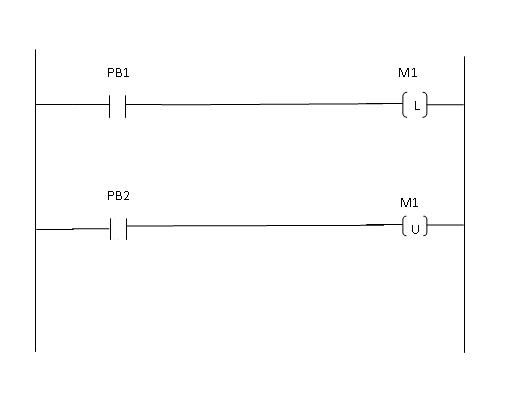

### Working of Direct-On-Line (DOL) starter:

One method of starting electric motors is using direct on line (DOL) or across the line starter. In this method full line voltage is applied to the motor terminals. This is simplest type of motor starter. An electrical wiring diagram for single phase DOL starter is shown below.

A DOL motor starter contains fuse and over load relay (OLR) for protection purpose. The starter can be contain momentary contact or maintained contact push buttons. The example considered here is momentary contact push buttons. For starting purpose normally open (NO) push button is preferred whereas normally closed (NC) push button is used to stop the motor.
The excessive supply voltage drop causing high inrush current is the criteria to limit the use of DOL starter. Conveyor motors, water pumps are the applications where DOL starters are used.
### Procedure
Problem Statement: To start a motor using DOL starter .
The simple P&I ; diagram for this problem is as below.

Listing of Input and Output devices:
Inputs: PB1- To start the motor
PB2- To stop the motor
Output: M1- Motor

Sequence of Events :
1. When Start push button (PB1) is pressed, Motor (M1) has to start.
2. If Start pushbutton (PB1) is released and Stop pushbutton (PB2) is not pressed, Motor (M1) should remain on.
3. When Stop push button (PB2 is pressed, Motor (M1) has tol stop.
4. If stop push button is released and start is not pressed (released) motor shouldl remain off.

The Boolean equation to represent this sequence is

The ladder diagram to implement these equations is shown below.

As the momentary contact push buttons are used here, the condition of PB1 is maintained through contact of coil C1. This contact is called as latching contact.
The same sequence of event can be executed by using latch and unlatch instruction in the following way.

